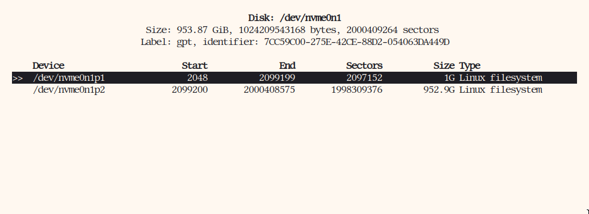
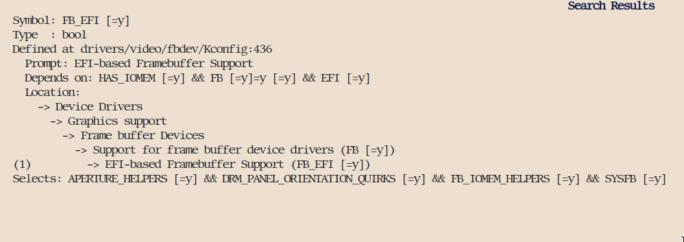
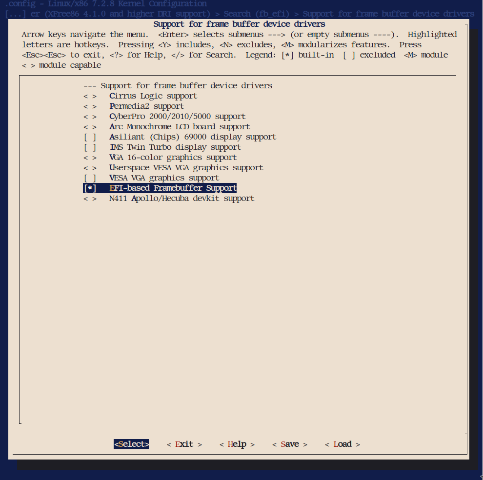

# Гайд на установку Exherbo GNU/Linux (2026)

# 1.0 Почему Exherbo GNU/Linux?
Exherbo Linux, это дистрибутив на базе Gentoo GNU/Linux. Но базирован он скорее не на коде - а на идеях. В Exherbo, ты компилируешь все с исходного кода, и имеешь возможность использовать use-флаги. <br>

Данный дистрибутив рассчитан на использование опытными пользователями, которые уже имеют довольно хорошее понимание о Linux, и так же готовы принять участие в его разработке. Но установить его, и использовать может каждый! В этом руководстве будет расписан каждый шаг, и объяснения действий для успешной установки Exherbo GNU/Linux. <br>

В этом руководстве я покажу установку glibc systemd Exherbo GNU/Linux

# 1.1 Что такое USE-флаги?
USE-флаги, это флаги которые ты выставляешь пакетам с целью кастомизации. <br>
Самый популярный пример дистрибутива с USE-флагами, это Gentoo GNU/Linux. Главная особенность Gentoo - это компиляция с исходников, а так же use-флаги. <br>

Пример использования:
Я хочу установить GRUB, с поддержкой UEFI! <br>

В /etc/paludis/options.conf: <br>
```
sys-boot/grub efi
```

Добавив флаг "efi", вы дали знать пакетнику что вы хотите скомпилировать grub с UEFI-поддержкой. Это лишь базовый пример, на самом деле применений у use-флагов очень много. Можно минимизировать пакеты, вырезая из них не нужное вам, и так далее. Коротко: use-флаги позволяют вам кастомизировать пакеты под ваш вкус и цвет.

# 1.2 Подготовка к установке.
У Exherbo GNU/Linux отсутствует Live-ISO. В моем случае, я использую CachyOS Live-ISO для установки. Но вы можете использовать любой, который имеет нужные инструменты. Используйте dd в Linux чтобы перезаписать данные на флешке с нужным Live-ISO или Rufus если вы на Windows. <br>

# 1.3 Разделы
Мы создадим 2 раздела, для простой установки. По желанию можно использовать и home раздел, про это написано в https://exherbo.org/docs/install-guide.html.

Для этого, мы используем команду:
``` 
cfdisk /dev/sdX
```

Ваши разделы должны выглядеть примерно так: <br>
 <br>
В моем случае, /dev/sdX1 - это будет ESP, а root будет /dev/sdX2. <br>

Теперь, мы отформатируем разделы.

## UEFI:
```
mkfs.vfat -F32 /dev/sdX1
mkfs.ext4 /dev/sdX2
```

## Legacy
```
mkfs.ext2 /dev/sdX1
mkfs.ext4 /dev/sdX2
```

# 1.4 Установка базы
Мы должны создать директорию для монтирования, и вмонтировать наш root-раздел. Это всё делается за одну линию: <br>
```
mkdir /mnt/exherbo && mount /dev/sdX2 /mnt/exherbo && cd /mnt/exherbo
```

После этого, мы скачиваем stage-файл Exherbo Linux. Стейдж файл содержит в себе базу системы. <br>
```
curl -O https://stages.exherbo.org/x86_64-pc-linux-gnu/exherbo-x86_64-pc-linux-gnu-gcc-current.tar.xz
```
После того как вы скачали этот файл, можно прописать ```tar xJpf exherbo*xz```, чтобы распаковать все. 

# 1.5 fstab

Чтобы наша система запустилась, нам нужно создать файл `fstab`. В нём расписано, что и как нужно монтировать при запуске системы.

Перед этим, мы используем команду "blkid" что-бы узнать UUID разделов.
```
blkid
```

Вам выдаст что-то на подобии этого:
```
/dev/sdX1: UUID="A5C4-002D" BLOCK_SIZE="512" TYPE="vfat" PARTUUID="2c198782-00fd-466f-885a-34e49a4a6c28"
/dev/sdX2: UUID="43431f15-e4ca-418c-a737-029f3696550f" BLOCK_SIZE="4096" TYPE="ext4" PARTUUID="af9bbeb5-b6f5-40ff-adff-f4dcf9c28932"
```
Здесь нам нужен UUID и TYPE. Это будет использовано в fstab.
## Важно
UUID и TYPE будут отличаться в вашем blkid, в зависимости от того как вы их отформатировали (ext2/vfat). <br>
# 
После того как мы получили UUID="" наших разделов, мы можем отредактировать fstab:
```bash
vim /etc/fstab
```

UEFI:
```
# <fs>                                       <mountpoint>    <type>    <opts>      <dump/pass>
UUID=43431f15-e4ca-418c-a737-029f3696550f    /               ext4      defaults    0 1
UUID=A5C4-002D                               /boot/efi       vfat      defaults    0 0
```

Legacy/BIOS:
```
# <fs>                                       <mountpoint>    <type>    <opts>      <dump/pass>
UUID=43431f15-e4ca-418c-a737-029f3696550f    /               ext4      defaults    0 1
UUID=A5C4-002D                               /boot/efi       ext2      defaults    0 0
```

## Важно:
"/boot/efi" это лишь точка вмонтирования. Поэтому можно использовать этот путь и на Legacy/BIOS. Но можно и использовать /boot, просто мне привычнее /boot/efi.

# 1.6 Chroot, установка ядра.
Монтируем по очереди: <br>

```bash
mount -o rbind /dev /mnt/exherbo/dev/
```

```bash
mount -o rbind /sys /mnt/exherbo/sys/
mount -t proc none /mnt/exherbo/proc/
mkdir -p /mnt/exherbo/boot/efi 
mount /dev/sdX1 /mnt/exherbo/boot/efi
```

Сделайте это, чтобы у вас была возможность подключиться к интернету.

```
cp /etc/resolv.conf /mnt/exherbo/etc/resolv.conf
```

Chroot
```bash
env -i TERM=$TERM SHELL=/bin/bash HOME=$HOME $(which chroot) /mnt/exherbo /bin/bash
source /etc/profile
export PS1="(chroot) $PS1"
```

Проверьте что Paludis настроен правильно. Это можно пропустить. <br>
```bash
cd /etc/paludis && vim bashrc && vim *conf
```

Синхронизация пакетов.
```
cave sync
```
Это синхронизирует все пакеты с нынешними версиями.

## Совет:
Зайдите в /etc/paludis/options.conf, найдите ```*/* build_options: jobs=2```, и поменяйте значение jobs на количество ваших потоков процессора чтобы пакеты компилировались быстрее. Чтобы узнать количество потоков, напишите ```nproc``` в терминале. <br>

# 1.7 Скачивание ядра
Во многих дистрибутивах, ядро идет уже установленным, или имеет собственный пакет, который можно просто установить. В случае с Exherbo Linux, так сделать НЕЛЬЗЯ! Вам нужно компилировать ядро с нужными настройками в ручную. Здесь я распишу что и как нужно делать в зависимости от того используете вы SATA / NVME. В качестве ядра, я буду использовать последнюю стабильную версию, то есть Linux 7.2.8. Вы можете скачать последнюю stable версию <a href="https://www.kernel.org/"> тут. </a> <br>

Для начала, мы скачаем и распакуем ядро. Я использую команду wget для того, чтобы скачать архив ядра:
```bash
cd /usr/src/
wget https://cdn.kernel.org/pub/linux/kernel/v7.x/linux-7.2.8.tar.xz
tar -xf linux-7.2.8.tar.xz
cd linux-7.2.8
```

# 1.8 Настройка ядра
Это может показаться сложной частью для некоторых, ведь компиляцией собственного ядра занимается не каждый. Но здесь я расскажу что вам нужно включить для того что-бы ваша система заработала!

## Базовые настройки:
```bash
make menuconfig
```
Вы увидите меню, в котором кучу всяких модулей и так далее. Вы можете нажать кнопку / чтобы включить поиск. Туда, напишите "FB_EFI". Вы увидите что то на подобии этого:

<br><br>
Вы можете нажать 1 чтобы перейти к этому модулю. <br>
Теперь, вы можете включить модуль ```EFI-based Framebuffer Support```. <br>
 <br>

## Если вы пользуетесь NVMe диском:
Используя поиск, убедитесь что включены модули:
```bash
CONFIG_BLK_DEV_NVME
CONFIG_FB_EFI -- включаем только на UEFI системах
```
## Если вы пользуетесь SATA диском:
Используя поиск, убедитесь что включены модули:
```bash
CONFIG_ATA
CONFIG_SATA_AHCI
CONFIG_FB_EFI -- включаем только на UEFI системах
```

Теперь можно стрелочками выбрать save, и выйти с помощью quit.

## Компиляция ядра & установка
Теперь когда мы вышли из настроек ядра, можно по очереди написать эти 3 команды, что-бы скомпилировать и установить ядро:
```
make -j$(nproc)
make modules_install
make install
```
Компиляция может занять немного времени.

# 1.9 Обновление world, загрузчик

Мы прошли самую сложную часть руководства. Теперь осталось лишь обновить world (т.е. все пакеты) и закончить установку! <br>
Перед обновлением world, советую добавить -recommended_tests в build_options. Это ускорит установку и исправит некоторые ошибки при установке пакетов. Это делается следующим образом:
```vim /etc/paludis/options.conf```
```
*/* build_options: jobs=12 -recommended_tests
```

Теперь, мы обновим world. Введите эту команду (Обновление может занять долго):
```bash
cave resolve -cx world
```

И теперь нужно переустановить systemd, чтобы создать machine-id (Не обязательно, но рекомендуется.)
```bash
cave resolve --execute --preserve-world --skip-phase test sys-apps/systemd
```

После переустановки systemd, мы можем установить загрузчик. В моем случае я буду использовать GRUB. <br>
Для UEFI-систем обязательно нужно добавить use-флаг "efi" для пакета sys-boot/grub. Это можно сделать одной командой.
```bash
echo "sys-boot/grub efi" >> /etc/paludis/options.conf"
```
В свою очередь для Legacy/BIOS систем это не требуется. Теперь мы установим GRUB:
```bash
cave resolve -x sys-boot/grub
```
После этого, можно спокойно ввести:

```bash
grub-install /dev/sdX
```

После успешной установки GRUB на ваш диск, можно сгенерировать конфиг. Это делается следующим образом:
```bash
grub-mkconfig -o /boot/grub/grub.cfg
```

## Совет #2 
У многих есть заблуждение что нужно обязательно добавлять аргументы по типу --efi-directory, --target и т.д. при установке GRUB на UEFI системах, но на самом деле можно просто использовать ```grub-install /dev/sdX``` и оно установит GRUB даже на UEFI системах без проблем.

# 2.0 Финализация
Мы прошли самую сложную стадию установки Exherbo GNU/Linux. Теперь мы можем начать финализацию установки. <br>
Для начала, можно добавить имя хоста:
```bash
echo my-hostname > /etc/hostname
```

Так же, в /etc/hosts, вы можете удалить там абсолютно все, и написать это:
```bash
127.0.0.1    my-hostname    localhost
::1          my-hostname    localhost
```

my-hostname вы можете заменить на абсолютно любой текст, важно лишь то что бы в нем не было пробелов. <br>

Если вам нужна более широкая поддержка железа, вы можете установить linux-firmware (Рекомендуется.)
```bash
cave resolve linux-firmware
```
С большой вероятностью, при установке linux-firmware вам выдаст это:
```bash
(chroot) EndeavourOS / # cave resolve linux-firmware
Done: 4 steps

These are the actions I will take, in order:

(nothing to do)
I encountered the following errors:

!   firmware/linux-firmware
    Reasons: target
    Unsuitable candidates:
      
firmware/linux-firmware-20260916:0::unavailable (in ::hardware)
      Masked by unavailable (In a repository which is unavailable)
firmware/linux-firmware-scm:0::unavailable (in ::hardware)
    Masked by unavailable (In a repository which is unavailable)

(chroot) EndeavourOS / #
```

В этом нет ничего страшного. Это лишь означает, что вам не доступен репозиторий откуда вы хотите скачать пакет. Решается это очень просто, вам нужно просто скачать репозиторий:
```bash
cave resolve -x repository/hardware
```
Данная команда установит вам репозиторий hardware, в котором и находится linux-firmware. Так можно делать с любыми недоступными репозиториями кроме graveyard. <br>

Теперь можно поменять пароль рут-аккаунту.
```bash
passwd
```

По желанию можно создать пользователя:
```bash
useradd -mG wheel,audio,video avudn
passwd avudn
```
При создании пользователя вам выдаст предупреждение
```bash
Creating mailbox file: No such file or directory
```
Оно безобидное и ничего не значит. Его можно проигнорировать <br>

Теперь можно создать локали. В нашем случае, я добавлю англ., и рус. локаль.
```bash
localedef -i en_US -f ISO-8859-1 en_US
localedef -i ru_RU -f UTF-8 ru_RU.UTF-8
```
Так же можно поменять системную локаль, но можно это и пропустить. По умолчанию используется ```en_GB.UTF-8```:
```bash
echo LANG="en_US.UTF-8" > /etc/env.d/99locale
```

Теперь можем добавить часовой пояс. Чтобы посмотреть доступные часовые пояса, вы можете написать например ls /usr/share/zoneinfo/Europe, и использовать его. В моем случае, я буду использовать Berlin:
```bash
ln -s /usr/share/zoneinfo/Europe/Berlin /etc/localtime
```


## ВАЖНО
В официальном руководстве на установку Exherbo GNU/Linux не написана одна из самых важных вещей - вам буквально нужно включить сервис что бы вы могли загрузиться в TTY, а так же включить systemd-resolved чтобы иметь интернет.
```bash
systemctl enable systemd-resolved
systemctl enable getty@
```
Теперь можно выйти из chroot:
```bash
exit
cd
```
Размонтировать разделы:
```bash
umount -Rl /mnt/exherbo
```
Убедитесь что они размонтированы:
```bash
lsblk
```

И финальный: 
```bash
reboot
```

Поздравляю! Если вы сделали всё правильно, то вы установили рабочую систему Exherbo GNU/Linux. Теперь вы можете установить желаемую среду рабочего стола.

# BONUS: Рабочая среда
Итак. Вы попали в TTY. Теперь, время сделать систему юзабельной. В качестве оконного менеджера, я буду использовать MangoWM, на базе wlroots.

Для начала, я бы скачал ```doas``` что-бы иметь возможность запускать все как администратор в будущем. Для этого, нам еще будет нужен репозиторий somasis в котором находиться doas.
```
cave resolve -x repository/somasis
cave resolve -x doas
```
Теперь, мы можем отредактировать конфиг чтобы пользователи группы wheel могли пользоваться doas. <br>
```/etc/doas.conf:```
```
permist persist :wheel
```
Готово! Теперь doas смогут пользоваться все пользователи группы wheel. <br>

# NVIDIA Драйвера
Это довольно странная часть, ибо драйвера NVIDIA на Exherbo Linux не устанавливаются просто одной командой. Вам придется компилировать опен-кернел модули в ручную. <br>
Для начала, вам нужно скачать пакет x11-drivers/nvidia-drivers.
```
cave resolve -x nvidia-drivers
```
После этого, вы должны перейти в директорию /usr/src/nvidia-drivers-(версия) и прописать 1 команду. В моем случае я использую nvidia-drivers-615.71.09:
```
cd /usr/src/nvidia-drivers-615.71.09
make modules_install
```
Теперь перегенерируем конфиг в grub.
grub-mkconfig -o /boot/grub/grub.cfg.

Готово! Теперь вам нужно лишь перезапустить компьютер и у вас заработают драйвера.

# AMD/Intel драйвера
```
cd /usr/src/linux-7.x.x
make menuconfig
```
В случае если у вас AMD видеокарта, вам нужно включить следующий модуль в ядре Linux:
```
CONFIG_DRM_AMDGPU
```

Если встроенная от Intel:
```
CONFIG_DRM_I915
```

Теперь можно скомпилировать и установить ядро:
```
make -j$(nproc)
make modules_install
make install
```

Теперь перегенерируем конфиг в grub.
```
grub-mkconfig -o /boot/grub/grub.cfg.
```

Готово! Теперь вам нужно лишь перезапустить компьютер и у вас заработают драйвера.
Теперь перейдем к самому MangoWM. Перед установкой зависимостей, крайне рекомендую на время добавить глобальный use-флаг на gobject-introspection:
```vim /etc/paludis/options.conf```
```
*/* gobject-introspection
```
Теперь можем установить нужные зависимости:
```
doas cave resolve wayland wayland-protocols libinput libdrm libxkbcommon pixman libdisplay-info hwdata pcre2 pango cjson xwayland libxcb
```
У вас возможно будет ошибка что недоступны некоторые репозитории. Просто установите каждый с помощью:
```
cave resolve -x repository/(название)
```

После установки всех зависимостей, можно перейти к компиляции wlroots, scenefx, mangowm:
## wlroots
```
git clone -b 0.20.2 https://gitlab.freedesktop.org/wlroots/wlroots.git
cd wlroots
meson build -Dprefix=/usr
ninja -C build install
```

## scenefx
```
git clone -b 0.5 https://github.com/wlrfx/scenefx.git
cd scenefx
meson build -Dprefix=/usr
ninja -C build install
```

# MangoWM
```
git clone https://github.com/mangowm/mango.git
cd mango
meson build -Dprefix=/usr
ninja -C build install
```


Теперь у вас есть рабочий MangoWM. Можно выйти с аккаунта root с помощью ```exit```, и зайти в вашего пользователя которого вы создали до этого. Запустить MangoWM можно просто с помощью команды mango в tty. По желанию можно и установить Display Manager. 
